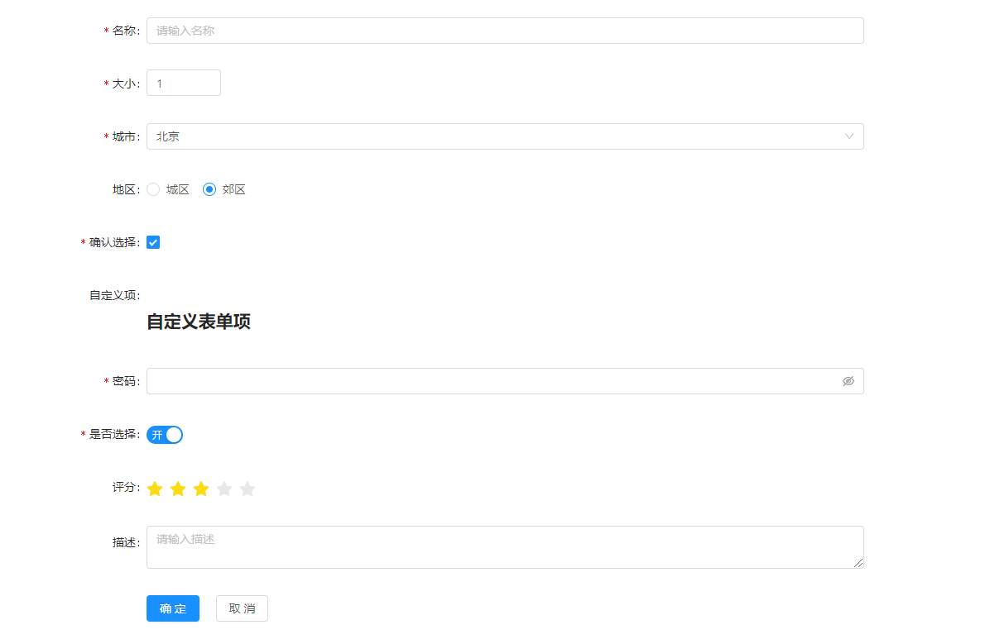
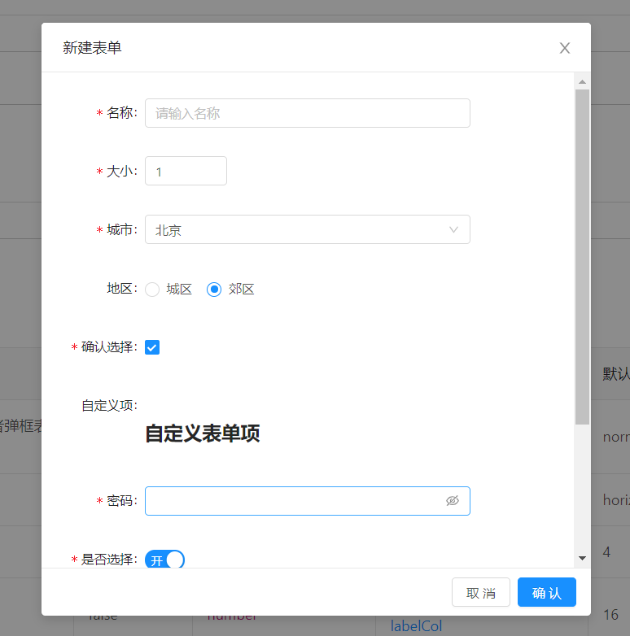

# uform

基于 antd 表单实现的自定义表单，简单实用，支持常用表单及弹窗表单，支持`Input`、`InputNumber`、`Textarea`、`Select`、`Radio`、`Checkbox`、`Password`、`Switch`、`Rate`、`custom（自定义ReactNode）`。

**documentation：[https://dadaiwei.github.io/uform](https://dadaiwei.github.io/uform)**
<br>
**npm：[https://www.npmjs.com/package/uform](https://www.npmjs.com/package/uform)**

## 基本介绍

基于 antd 组件库定制的简单易用 Form，支持通用表单及弹框表单两种形式，支持 Input、InputNumber、Textarea、Select、Radio、Checkbox、Password、Switch、Rate、custom（自定义 ReactNode）。

## 使用指南

1.安装 UForm 依赖包

```
npm install uform --save-dev
```

2.引入依赖包

```
import UForm from "uform";
import "uform/dist/uform.css";
```

3.使用 UForm 组件

```
<UForm
    data={data}
    fields={fields}
    onChange={onChange}
    onCancel={onCancel}
    onSubmit={onSubmit}
    />
```

## 代码演示

### 通用表单



代码

```
function NormalForm() {
  const [data, setData] = useState({
    name: "",
    size: 1,
    city: 0,
    area: "郊区",
    password: "",
    choosen: true,
    confirm: true,
    rate: 3,
    describe: ""
  });
  const fields = [
    {
      name: "name",
      label: "名称",
      type: "input",
      placeholder: "请输入名称",
      rules: [
        {
          required: true,
          message: "请输入名称"
        }
      ]
    },
    {
      name: "size",
      label: "大小",
      type: "inputNumber",
      placeholder: "请输入大小",
      rules: [
        {
          required: true,
          message: "请输入名称"
        }
      ]
    },
    {
      name: "city",
      label: "城市",
      type: "select",
      fieldData: [
        {
          name: "北京",
          value: 0
        },
        {
          name: "上海",
          value: 1
        },
        {
          name: "杭州",
          value: 2
        },
        {
          name: "深圳",
          value: 3
        }
      ],
      rules: [
        {
          required: true,
          message: "请输入名称"
        }
      ]
    },
    {
      name: "area",
      label: "地区",
      type: "radio",
      fieldData: ["城区", "郊区"]
    },
    {
      name: "confirm",
      label: "确认选择",
      type: "checkbox",
      rules: [
        {
          required: true,
          message: "请确认选择"
        }
      ]
    },
    {
      name: "custom",
      label: "自定义项",
      type: "custom",
      node: (
        <div>
          <h2>自定义表单项</h2>
        </div>
      )
    },
    {
      name: "password",
      label: "密码",
      type: "password",
      rules: [
        {
          required: true,
          message: "请输入密码"
        }
      ]
    },
    {
      name: "choosen",
      label: "是否选择",
      type: "switch",
      checkedChildren: "开",
      unCheckedChildren: "关",
      rules: [
        {
          required: true,
          message: "请输入密码"
        }
      ]
    },
    {
      name: "rate",
      label: "评分",
      type: "rate"
    },
    {
      name: "describe",
      label: "描述",
      type: "textarea",
      placeholder: "请输入描述"
    }
  ];
  const onChange = (result) => {
    setData({
      ...data,
      ...result
    });
  };
  const onSubmit = (values) => {
    console.log(values);
  };
  const onCancel = () => {
    console.log("cancel");
  };
  return (
    <div>
      <div style={{ width: 600, marginLeft: 100 }}>
        <UForm
          data={data}
          fields={fields}
          onChange={onChange}
          onCancel={onCancel}
          onSubmit={onSubmit}
        />
      </div>
    </div>
  );
}
```

### 弹窗表单



代码

```
function ModalForm() {
  const { visible, setVisible } = useState(false);
  const [data, setData] = useState({
    name: "",
    size: 1,
    city: 0,
    area: "郊区",
    password: "",
    choosen: true,
    confirm: true,
    rate: 3,
    describe: ""
  });
  const fields = [
    {
      name: "name",
      label: "名称",
      type: "input",
      placeholder: "请输入名称",
      rules: [
        {
          required: true,
          message: "请输入名称"
        }
      ]
    },
    {
      name: "size",
      label: "大小",
      type: "inputNumber",
      placeholder: "请输入大小",
      rules: [
        {
          required: true,
          message: "请输入名称"
        }
      ]
    },
    {
      name: "city",
      label: "城市",
      type: "select",
      fieldData: [
        {
          name: "北京",
          value: 0
        },
        {
          name: "上海",
          value: 1
        },
        {
          name: "杭州",
          value: 2
        },
        {
          name: "深圳",
          value: 3
        }
      ],
      rules: [
        {
          required: true,
          message: "请输入名称"
        }
      ]
    },
    {
      name: "area",
      label: "地区",
      type: "radio",
      fieldData: ["城区", "郊区"]
    },
    {
      name: "confirm",
      label: "确认选择",
      type: "checkbox",
      rules: [
        {
          required: true,
          message: "请确认选择"
        }
      ]
    },
    {
      name: "custom",
      label: "自定义项",
      type: "custom",
      node: (
        <div>
          <h2>自定义表单项</h2>
        </div>
      )
    },
    {
      name: "password",
      label: "密码",
      type: "password",
      rules: [
        {
          required: true,
          message: "请输入密码"
        }
      ]
    },
    {
      name: "choosen",
      label: "是否选择",
      type: "switch",
      checkedChildren: "开",
      unCheckedChildren: "关",
      rules: [
        {
          required: true,
          message: "请输入密码"
        }
      ]
    },
    {
      name: "rate",
      label: "评分",
      type: "rate"
    },
    {
      name: "describe",
      label: "描述",
      type: "textarea",
      placeholder: "请输入描述"
    }
  ];
  const onChange = (result) => {
    setData({
      ...data,
      ...result
    });
  };
  const onSubmit = (values) => {
    console.log(values);
  };
  const onCancel = () => {
    setVisible(false);
  };
  return (
    <div>
      <Button
        type='primary'
        onClick={() => {
          setVisible(true);
        }}>
        打开弹窗表单
      </Button>
      <div style={{ width: 600, marginLeft: 100 }}>
        <UForm
          type="modal"
          visible={visible}
          title='新建表单'
          data={data}
          fields={fields}
          onChange={onChange}
          onCancel={onCancel}
          onSubmit={onSubmit}
        />
      </div>
    </div>
  );
}
```

## API

### 公共 API

| 属性       | 说明                     | 必填属性 | 类型             | 可选值                            | 默认值     |
| :--------- | :----------------------- | :------- | :--------------- | :-------------------------------- | :--------- |
| type       | 使用通用表单或者弹框表单 | false    | string           | norma \| modal                    | normal     |
| layout     | 表单布局                 | false    | string           | horizontal \| vertical \| inline  | horizontal |
| labelCol   | 表单 label 占宽          | false    | number           | 1-24 之间整数                     | 4          |
| wrapperCol | 表单内容项占宽           | false    | number           | 1-24 之间整数，通常为 24-labelCol | 16         |
| loading    | 确定按钮 loading         | false    | boolean          | true \| false                     | false      |
| data       | 表单数据                 | true     | any[ ]           | -                                 | [ ]        |
| fields     | 表单每一项特征描述       | true     | any[ ]           | -                                 | [ ]        |
| onSubmit   | 表单提交回调             | true     | Function(values) | -                                 | 无         |
| onChange   | 表单每一项修改回调       | false    | Function(value)  | -                                 | 无         |
| onCancel   | 表单取消回调             | false    | Function( )      | -                                 | 无         |

### fields props

| 属性       | 说明                                            | 必填属性 | 类型       | 可选值                                                                                                              | 默认值 |
| :--------- | :---------------------------------------------- | :------- | :--------- | :------------------------------------------------------------------------------------------------------------------ | :----- |
| name       | 表单数据 name，与 data 中 key 值一致            | true     | string     | -                                                                                                                   | 无     |
| type       | 表单项类型                                      | true     | string     | input \| inputNumber \| textarea \| select \| radio \| checkbox \| password \| switch \| rate \| custom（自定义项） | 无     |
| label      | 表单项 label                                    | true     | string     | -                                                                                                                   | 无     |
| rules      | 表单项限制规则，与 antd Form 限制规则一致       | false    | object [ ] | -                                                                                                                   | 无     |
| fieldData  | 适用于 type 为 select/radio 的选择项            | true     | object [ ] | -                                                                                                                   | 无     |
| placehoder | 适用于 type 为 input/textarea/select 的提示信息 | false    | string     | -                                                                                                                   | 无     |
| node       | 适用于 type 为 custom 的自定义 ReactNode        | true     | ReactNode  | -                                                                                                                   | 无     |

> **特别说明**：type 类型为 **select/radio**时， **fieldsData** 是必填属性， type 类型为 **custome** 时， **node** 是必填属性。

### 通用表单特有 API

| 属性             | 说明             | 必填属性 | 类型    | 可选值        | 默认值 |
| :--------------- | :--------------- | :------- | :------ | :------------ | :----- |
| showCancelButton | 是否展示取消按钮 | false    | boolean | true \| false | true   |

### 弹框表单特有 API

| 属性    | 说明         | 必填属性 | 类型                | 可选值        | 默认值 |
| :------ | :----------- | :------- | :------------------ | :------------ | :----- |
| visible | 弹框是否可见 | true     | boolean             | true \| false | true   |
| title   | 弹框标题     | true     | string \| ReactNode | -             | 无     |
| width   | 弹框宽度     | false    | number              | -             | 600    |

## License

[MIT](https://opensource.org/licenses/MIT)

Copyright (c) 2019 笪笪的前端小站
